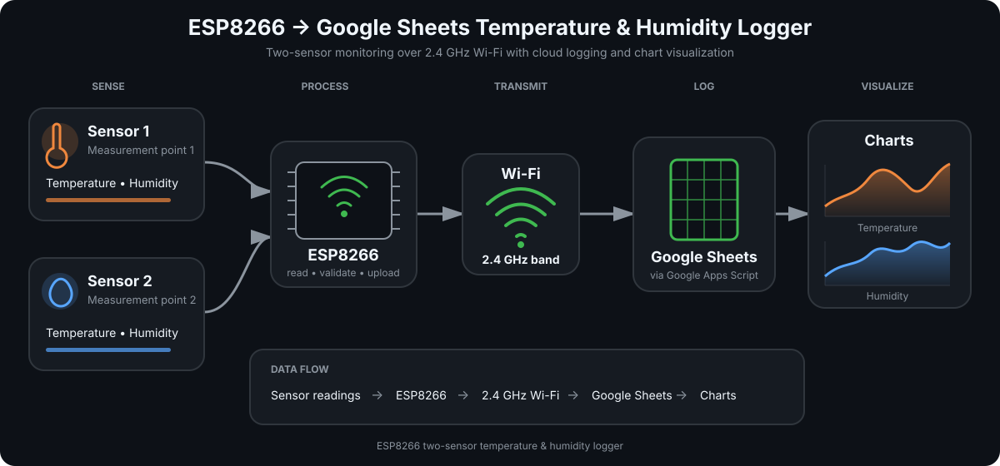

# Temperature Logger for Google Sheets

Log temperature and humidity to a private Google Sheet, then chart how conditions change over time. This ESP8266 project uses a Wemos D1 mini and two DHT22 sensors, collecting readings every 30 seconds and uploading a five-minute trimmed mean, plus LED feedback for connection, successful saves, and failures.

Choose two measurement locations, give them meaningful names in your dashboard, and adapt the sampling interval and spreadsheet time zone to your experiment. Once configured, the device runs from USB power without a computer or serial monitor. The current reference build supports **two DHT22 sensors**; indoor/outdoor monitoring is its original use case.

[Getting started](#getting-started) · [Wiring](#hardware-and-wiring) · [Charts](#google-sheets-charts) · [Customization](#customize-for-your-use-case) · [LED status](#built-in-led-status) · [Troubleshooting](#troubleshooting)

## Motivation: understand and reduce indoor heat

This project began as a way to understand why a room stays hot. Recording indoor and outdoor temperature variations together makes it easier to see when the room is warmer than the air outside, how the difference changes through the day and night, and what happens after a ventilation change.

The goal is to use those measurements to choose practical ways to reduce indoor heat: compare window-opening schedules, ceiling-fan and exhaust-fan conditions, or shading changes, and record their timing alongside the data. Temperature and humidity trends provide evidence for those decisions; each experiment should change one condition at a time.

The same logging workflow can compare two nearby rooms, two areas of one room, or two sides of a ventilation opening. The sensor positions and chart labels belong to the use case; the logger collects the readings.

## How it works



The ESP8266 sends both sensors' readings in one HTTPS request. Google Apps Script adds a timestamp, appends the row to the private spreadsheet, and returns a save acknowledgment. Follow the [chart instructions](#google-sheets-charts) to create the charts in Sheets; the diagram illustrates the workflow.

- **Two sensors, one row:** temperature in °C and relative humidity in %RH from both locations.
- **Automatic operation:** readings every 30 seconds, one aggregated report per five-minute window, and automatic Wi-Fi reconnection. The first report waits for a full window after startup checks.
- **Visible feedback:** a single built-in LED shows connection attempts, connection success, confirmed saves, and failures.
- **Verified delivery:** HTTPS certificate validation, a shared device token, and a saved-row acknowledgment from Google.
- **Small setup:** no always-on computer, separate server, SD card, RTC, or database to maintain.
- **Bench diagnostics:** separate firmware for checking Wi-Fi and sensor communication.
- **Google Sheets charts:** [dashboard instructions](#google-sheets-charts) for custom sensor labels, temperature and humidity trends, and the temperature difference between the two locations.

Keep the controller indoors and dry. The reference wiring labels sensor 1 as indoor and sensor 2 as outdoor. The windowed logger was bench-tested with a real D1 mini, two DHT22 sensors, and Google Sheets on **2026-09-10**: two consecutive windows each collected 10 valid pairs, their trimmed means matched independent calculations, and Google acknowledged both saves. This does not establish sensor calibration or long-term reliability. Follow the [verification steps](#5-verify-the-first-readings) for your own installation.

## Hardware and wiring

| Component | Quantity | Notes |
| --- | --- | --- |
| LOLIN/Wemos D1 mini **ESP8266** | 1 | This project targets PlatformIO's `d1_mini` board |
| DHT22/AM2302 three-pin sensor module | 2 | One per measurement location; wiring below assumes modules |
| Three-conductor sensor cable | 2 leads | Each lead at most **1 m** at 3.3 V |
| Micro-USB data cable | 1 | Needed for programming; also supplies power |
| 5 V USB adapter | 1 | Standalone operation |
| Ventilated rain/sun shield | As needed | For any sensor exposed to outdoor conditions |
| Insulated enclosure and secure connections | As needed | Keep the controller dry and support the cables |

Disconnect power before changing wiring. Follow each module's printed labels; pin order can vary.

| D1 mini pin | Sensor 1 (default: indoor) | Sensor 2 (default: outdoor) |
| --- | --- | --- |
| `3V3` | VCC | VCC |
| `G` / `GND` | GND | GND |
| `D1` / GPIO5 | DATA | — |
| `D2` / GPIO4 | — | DATA |

`D4` / GPIO2 drives the built-in status LED; leave it available for the firmware. Power the **board through its 5 V USB connector**, and power **both sensors from `3V3`**. The ESP8266 uses 3.3 V GPIO; a sensor module powered from 5 V may pull its DATA line up to 5 V. See the [WEMOS pin reference](https://www.wemos.cc/en/latest/d1/d1_mini_3.1.0.html) and [AM2302 manufacturer manual](https://www.aosong.com/uploadfiles/2025/04/20250417105409216.pdf) for electrical and cable-length requirements. Bare four-pin sensors require their own pin mapping and pull-up arrangement.

## Getting started

### 1. Prepare the tools and network

Download or clone this project and open its root directory in a terminal. Install [PlatformIO Core or the PlatformIO IDE extension for VS Code](https://docs.platformio.org/en/latest/core/installation/index.html). The extension includes Core and provides a PlatformIO terminal for the `pio` commands below.

You also need Python 3 for the receiver checker, a Google account that can deploy an Apps Script web app with anonymous access, and a **2.4 GHz Wi-Fi network with internet access**. A router may use the same SSID for 2.4 GHz and 5 GHz; the ESP8266 joins the 2.4 GHz band. See the [ESP8266EX datasheet](https://www.espressif.com/sites/default/files/documentation/0a-esp8266ex_datasheet_en.pdf).

Commands run from the project root. On Windows, use `python` or `py -3` in place of `python3` if needed. PlatformIO installs the configured board support and libraries during the first build.

### 2. Create your local settings

Copy these templates to the corresponding local filenames **if those files do not already exist**:

| Template | Local file | Values to set |
| --- | --- | --- |
| [wifi_secrets.example.h](include/wifi_secrets.example.h) | `include/wifi_secrets.h` | `WIFI_SSID`, `WIFI_PASSWORD` |
| [logger_secrets.example.h](include/logger_secrets.example.h) | `include/logger_secrets.h` | `LOGGER_SCRIPT_URL`, `LOGGER_DEVICE_TOKEN` |

Edit the values inside the existing C++ quotation marks. Match the SSID exactly, including leading or trailing spaces. Generate a device token locally:

```sh
python3 -c "import secrets; print(secrets.token_hex(16))"
```

Set `LOGGER_DEVICE_TOKEN` to the generated **32-character hexadecimal token**. Keep it for the Google setup step. The two local headers are excluded by `.gitignore`; the example headers remain empty and safe to share.

### 3. Set up Google Sheets

1. Create a Google spreadsheet, then open **Extensions → Apps Script**.
2. Replace the editor's `Code.gs` contents with [apps-script/Code.gs](apps-script/Code.gs) and save.
3. Under **Project Settings → Script properties**, set `SHEET_ID` to the spreadsheet ID between `/d/` and `/edit` in its URL. Set `DEVICE_TOKEN` to the same 32-character hexadecimal value as `LOGGER_DEVICE_TOKEN`. Enter property values without quotation marks.
4. Review `TIME_ZONE` in `Code.gs` and set it to your preferred spreadsheet time zone. The default is `Asia/Colombo`; this setting applies to the entire spreadsheet.
5. Select **setup** in the editor's function dropdown, click **Run**, and authorize your script. Confirm that setup succeeds and the `Measurements` tab contains the five [required headers](#data-and-failure-behavior).

Deploy the script as a **Web app**, with **Execute as: Me** and **Who has access: Anyone**. The device needs access without Google sign-in; **Anyone with a Google account** does not meet that requirement. The spreadsheet itself can remain **Restricted**. Google's [web app documentation](https://developers.google.com/apps-script/guides/web) explains execution permissions.

Copy the production URL ending in `/exec` into `LOGGER_SCRIPT_URL`. Use the same token in the firmware and Script Properties. The receiver creates the `Measurements` tab and its headers; an empty spreadsheet containing only `Sheet1` is fine.

When updating the receiver later, save the script and use **Deploy → Manage deployments → Edit → New version → Deploy** to update the existing endpoint. Saving source alone does not update a versioned deployment. Run `setup()` again if you change the spreadsheet time zone.

Check the deployed endpoint:

```sh
python3 scripts/check_receiver.py
```

Expect two `PASS` messages: anonymous health access and invalid-token rejection. This check adds no measurement rows and does not verify that your real token or spreadsheet configuration is correct; `setup()` and a real device save complete those checks.

### 4. Build and upload

Connect the wired board using a USB data cable. Close any other serial monitor, then run:

```sh
pio device list
pio run -e d1_mini
pio run -e d1_mini -t upload
pio device monitor -b 115200
```

If automatic port selection fails or multiple devices are connected, use the port shown by `pio device list`:

```sh
pio run -e d1_mini -t upload --upload-port /dev/ttyUSB0
pio device monitor -p /dev/ttyUSB0 -b 115200
```

Replace `/dev/ttyUSB0` with your actual port, such as `COM3` on Windows or a `/dev/cu.*` device on macOS. For WSL, attach the USB device using [Microsoft's USB connection guide](https://learn.microsoft.com/en-us/windows/wsl/connect-usb); unplugging it may require another attachment.

### 5. Verify the first readings

Press RESET after opening the serial monitor if you missed startup. The logger waits for the sensors, attempts Wi-Fi connection and network-time synchronization, then starts its first five-minute window. Expect `[SAMPLE]` lines about 30 seconds apart, each with the current valid-pair count and four raw readings. There is no immediate startup upload.

After five minutes of collection, expect `[REPORT] Trimmed mean of ...`, followed by `[PASS] Saved Google Sheet row ...` and the four-flash LED pattern. Check that `Measurements` contains a new row with four numeric readings to one decimal place. A healthy window normally contains 10 valid pairs; at least 6 are required.

Leave the device running through a second window and confirm a second row. For one complete window, record the serial readings, sort each of the four fields independently, remove one lowest and one highest value, and average the rest. The result rounded to one decimal should match that sheet row. Network setup and upload time mean spreadsheet timestamps will not be exactly five minutes apart.

For failure recovery, power off before disconnecting either sensor's DATA lead, then restart: raw pairs should be rejected and the five-minute report skipped with the failure LED. Power off, restore the wiring, and restart to confirm valid reports resume. Temporarily turning off the Wi-Fi access point can also verify that unconfirmed windows are discarded and later windows recover without duplicate POSTs.

## Google Sheets charts

After the first readings arrive, create a `Dashboard` tab. Put `Timestamp` and your four sensor labels in cells A1:E1, in the same order as the `Measurements` columns. Use names such as **Room A temperature**, **Room A humidity**, **Room B temperature**, and **Room B humidity**. Keep the original `Measurements` headers unchanged.

In `Dashboard!A2`, enter `=FILTER(Measurements!A2:E,Measurements!A2:A<>"")` to display the logged rows. Leave the cells below and to the right empty so the formula can expand. Format column A as date/time and columns B:E as numbers. For a difference series, put `Temperature difference °C` in F1 and `=ARRAYFORMULA(IF(A2:A="","",B2:B-D2:D))` in F2. Some spreadsheet locales require semicolons instead of commas in formulas.

| Chart | What it shows |
| --- | --- |
| Temperature over time | Timestamp in column A with temperature series B and D on one °C axis |
| Humidity over time | Timestamp in column A with humidity series C and E on a %RH axis |
| Temperature difference | Timestamp in column A with series F: sensor 1 minus sensor 2 |

Use **Insert → Chart**, choose a line chart, and set column A as the X-axis with the series listed above. Use the header row for labels and open-ended column ranges so future rows are included. Keep experiment notes in separate columns or another tab, outside the formula output.

## Built-in LED status

The D1 mini's built-in LED on **D4/GPIO2** is single-color and active-low, so status is shown with patterns rather than color changes. See the [WEMOS schematic](https://www.wemos.cc/en/latest/_static/files/sch_d1_mini_v3.0.0.pdf).

| Indication | Pattern | Meaning |
| --- | --- | --- |
| Connecting | 500 ms on, 500 ms off, repeating | A Wi-Fi connection attempt is in progress |
| Connected | Solid for **3 seconds**, then off | Wi-Fi connected or reconnected |
| Failure | **Three rapid flashes**, then a 2-second pause, repeating | Wi-Fi lost, invalid sensor sample, configuration problem, or save unconfirmed |
| Saved | **Two short flashes, pause, two short flashes** | Google acknowledged that both sensors were saved in one row |
| Waiting | Off | Normal between indications; darkness alone does not confirm power or health |

Each rapid flash lasts 100 ms. The saved pattern has a 400 ms pause between pairs. If a save completes during the connected indication, the full three-second light and a short dark gap finish before the four flashes.

The failure pattern continues until another status replaces it. The LED reports the latest event; use serial messages at **115200 baud** to identify the specific failure. A three-second connected light confirms Wi-Fi connectivity, while the four flashes confirm a saved row. A timer drives the LED while sensor and network operations run.

## Install and use

1. Compare both sensors side by side in stable room air for at least **30 minutes**. Record any consistent difference before comparing locations; communication checks do not establish measurement accuracy.
2. Place the controller indoors with secure connections and each sensor lead no longer than 1 m. Position each sensor to measure the intended location, away from board heat and direct sunlight. For the indoor-heat experiment, also keep the indoor sensor away from direct fan airflow.
3. Put any outdoor sensor in a ventilated rain/sun shield, away from the exhaust outlet. Protect it from rain and condensation while allowing surrounding air to reach it.
4. Power the board from a **5 V USB adapter** within range of the configured Wi-Fi. No computer is needed. It starts the logger automatically after power-up or reset.
5. Confirm the startup indications and a new sheet row at the installed location, then check subsequent rows periodically.

For ventilation experiments, change one condition at a time and record the change times alongside the measurements. Compare a baseline period with periods using a ceiling fan or exhaust fan, keeping sensor positions consistent.

## Data and failure behavior

Each successful request appends these columns to the `Measurements` tab. The current schema retains the original use-case names; the channel mapping is fixed:

| Column | Contents |
| --- | --- |
| `Timestamp` | Google's request receipt time, stored as a spreadsheet date |
| `Indoor Temp °C` | Sensor 1 temperature — D1/GPIO5 |
| `Indoor RH %` | Sensor 1 relative humidity — D1/GPIO5 |
| `Outdoor Temp °C` | Sensor 2 temperature — D2/GPIO4 |
| `Outdoor RH %` | Sensor 2 relative humidity — D2/GPIO4 |

The protocol fields (`indoor_t`, `indoor_rh`, `outdoor_t`, `outdoor_rh`) and serial labels follow the same mapping. Sensor 1 can physically be in a different location; change its dashboard label to describe that location. Do not rename `Measurements` headers in the sheet alone: the receiver checks them exactly and will reject a mismatch.

The receiver formats each appended timestamp as `yyyy-mm-dd hh:mm:ss` and readings to one decimal place, including when the append expands the sheet. Timestamps remain real spreadsheet dates. The spreadsheet time zone is **Asia/Colombo (UTC+05:30)**; acknowledgments use UTC ISO timestamps. Network time on the ESP is used for certificate verification; the device does not supply the sheet timestamp.

- **Acquisition:** every **30,000 ms**, prime both DHT22s, wait **2,200 ms**, then force a fresh read from each. Humidity and temperature use the same DHT transaction. The [AM2302 manual](https://www.aosong.com/uploadfiles/2025/04/20250417105409216.pdf) requires more than two seconds between reads for updated data; the firmware also preserves a refresh gap between the last read and the next prime.
- **Aggregation:** retain at most **10 complete pairs in RAM** per **300,000 ms** window. Sort each field independently, discard exactly one lowest and one highest value, and average the remainder. With 10 valid pairs, 8 values contribute per field. The upload still contains only the four aggregated fields, rounded to one decimal; raw values and counts appear only in serial output.
- Both sensors must return finite values within **−40 to 80 °C** and **0 to 99.9 %RH**. If either fails, discard the entire pair without substituting older values. At least **6 valid pairs** are required to report a window; 6–9 pairs use the same trimming rule, and fewer than 6 skip the upload and show failure. These are validation bounds, not a guarantee of sensor accuracy throughout the range.
- **Timing:** reports represent the preceding five-minute collection window, ending approximately at the sheet timestamp. The timestamp is still Google's receipt time, so network delay moves it later than the actual window end. Windows start after startup checks and are not aligned to wall-clock five-minute boundaries. Rebooting discards RAM samples and starts a new full window.
- **Missed slots:** sensor reads and network operations are blocking. Slow Wi-Fi/TLS/uploads can reduce the next window's sample count. Sampling resumes with one new observation and at least 30 seconds between attempt starts; missed slots are never filled with rapid catch-up reads. Report boundaries stay on the original five-minute schedule. Readings completed after their window ends are discarded, and fully missed windows are skipped without catch-up uploads.
- There is **no persistent offline storage or backfill**. The buffer is cleared when a window closes, before its upload attempt, regardless of validity or delivery success. Power loss, sensor errors, and unavailable internet can leave gaps.
- A measurement POST is sent once per eligible window. Google redirects are followed with GET requests to retrieve the reply. If the reply is lost, the row may already exist; the firmware reports an unconfirmed save and does not resend that window.
- The HTTP client allows a **60-second response-header inactivity wait** for each POST or response GET, accommodating slower Apps Script processing. This is not a total upload deadline. Serial output records request timings and Wi-Fi signal strength to help distinguish slow responses from connection problems.
- The design uses one shared token and no device identifier, so the sheet is intended for **one controller with two sensors**.
- There are no notifications, remote configuration, or over-the-air firmware updates. Changes to firmware settings require a USB rebuild/upload.

The receiver also depends on [Google Apps Script availability and quotas](https://developers.google.com/apps-script/guides/services/quotas). Keep measurement headers intact; use another tab for analysis and charts.

The trimmed mean reduces isolated fluctuations and represents the window better than a single spot reading. It does not correct sunlight heating, condensation, calibration offsets, or sensor placement. It also smooths brief real changes, so keep recording ventilation-event times and use the outdoor rain/sun shield.

## Troubleshooting

| Symptom | What to check |
| --- | --- |
| `pio` is not found | Open the PlatformIO IDE terminal, or follow the Core installation instructions linked above |
| No serial port or upload fails | Use a data-capable cable, check the board's USB serial driver and OS permissions, close other monitors, and specify the actual port; WSL may need USB reattachment |
| Wi-Fi connection times out | Check the exact SSID/password, 2.4 GHz availability, and signal at the installed location; use `wifi_check` below |
| Connected light appears, but there are no saved rows | Wi-Fi alone does not prove internet access; inspect serial output for time-sync, HTTPS, configuration, or acknowledgment errors |
| No row immediately after reset | The first report waits for a full five-minute window after startup checks; look for `[SAMPLE]` counts, then `[REPORT]` or a skipped-window explanation |
| Newest timestamp has a different format until the next save | Older receiver versions formatted only before appending, so newly allocated rows could retain the default date display. Replace Apps Script with the current `Code.gs`, save, and deploy a new version of the existing endpoint. Run `setup()` to refresh existing row formats immediately |
| Network time synchronization times out | Check internet/DNS access and whether the network permits NTP to `time.google.com` or `pool.ntp.org` |
| Google POST reports `read Timeout` | The HTTP client stopped waiting for a response. Check the sheet before assuming the sample was lost; the request may already have saved it. Firmware now allows 60 seconds for response-header inactivity, and the next scheduled sample can recover without a reset |
| Three rapid flashes keep repeating | Read the accompanying `[SKIP]` or `[FAIL]` serial message; the pattern covers several failure types |
| Sensor read failed or incomplete sample | Check 3V3/GND, DATA pin mapping, connections, sensor type, and cable length; run `sensor_check` below |
| Web app opens Google sign-in, or checker rejects a redirect | Update the active deployment to **Execute as: Me**, **Anyone**; use `/exec`, then recheck without a signed-in browser session |
| Public health check passes but saves fail | Run Apps Script `setup()`, verify `SHEET_ID` and the exact matching token, and inspect Apps Script executions for errors |
| Script edits appear to have no effect | Publish a **new version of the existing deployment**; saving the editor does not update the deployed version |
| `Measurements` header error | Restore the five [expected headers](#data-and-failure-behavior) without discarding existing data |
| Readings differ or humidity stays near its upper limit | Compare sensors side by side and inspect exposure to heat, wetting, and restricted airflow before interpreting the measurements |

### Wi-Fi diagnostic

This firmware scans nearby networks and attempts one connection with a 30-second timeout. An empty SSID runs only the scan. It does not test Google Sheets.

The diagnostic prints nearby network names, the configured SSID, and local IP/gateway addresses. Redact these details before sharing serial output.

```sh
pio run -e wifi_check -t upload
pio device monitor -b 115200
```

### Sensor diagnostic

This firmware checks both sensors every five seconds, reports Wi-Fi status and valid-read counts, and continues checking the other sensor if one fails. Observe at least five samples. It does not upload readings to Google Sheets.

```sh
pio run -e sensor_check -t upload
pio device monitor -b 115200
```

Both diagnostics use `include/wifi_secrets.h` and **replace the logger when uploaded**. Close the monitor and restore normal operation afterward:

```sh
pio run -e d1_mini -t upload
```

## Development and testing

The project uses PlatformIO with the ESP8266 Arduino framework. Adafruit DHT 1.4.7, Adafruit Unified Sensor 1.1.15, and ArduinoJson 7.4.2 are declared in [platformio.ini](platformio.ini). LED timing uses the core's built-in Ticker library.

Local checks need Node.js for the receiver tests and a host C++ compiler for PlatformIO's native tests. The documented baseline used Node.js 22, Python 3.12, Espressif8266 platform 4.2.1, and ESP8266 Arduino Core 3.1.2. The platform itself is not version-pinned, so record resolved versions when validating a new release.

```sh
node --test test/apps-script/receiver.test.cjs
pio test -e native
pio run -e d1_mini -e wifi_check -e sensor_check
```

These commands do not need a connected board or Google credentials. A fresh checkout builds against the empty example headers, which cannot upload measurements until configured. The first PlatformIO run needs internet access to install dependencies.

| Check | Coverage |
| --- | --- |
| Apps Script tests | Token and measurement validation, numeric rows, headers, setup, locking, and storage failures using substitutes for Google services |
| Native firmware tests | Trimmed means, valid-pair thresholds, window reset, delayed sampling/uploads, timer rollover, request encoding, measurement/URL validation, acknowledgment parsing, response-size boundaries, and LED timing/transitions |
| Three firmware builds | Compilation of the logger and both diagnostics for the ESP8266 |
| `python3 scripts/check_receiver.py` | Optional live endpoint health and invalid-token rejection; requires a configured URL, creates no measurement rows |
| Live device verification | Real sensor reads, Wi-Fi/TLS, saved-row acknowledgments, and sampling cadence; follow [first-reading verification](#5-verify-the-first-readings) |

Local tests do not establish physical wiring, optical LED appearance, Google account permissions, sensor accuracy, or long-duration reliability. After firmware or receiver changes, confirm real saved rows on hardware.

The 2026-09-10 hardware check observed sample intervals of **29.999–30.051 seconds**, a report interval of **299.984 seconds**, and Google receipt timestamps **300.102 seconds** apart, with no sensor or network errors in the two windows. Timing was measured with the capture host's `CLOCK_MONOTONIC_RAW`: its adjusted clock ran slower and initially made the cadence appear short. Failure recovery and optical LED appearance remain manual checks; the successful-save run does not validate them.

## Project structure

```text
.
├── README.md                       # Build, setup, operation, and maintenance
├── LICENSE                         # MIT license for this project
├── platformio.ini                  # Logger, diagnostics, and native test environments
├── apps-script/Code.gs              # Google Sheets receiver and setup function
├── docs/
│   └── assets/
│       └── esp8266-google-sheets-system.svg # System overview used above
├── include/
│   ├── *.example.h                 # Empty local-settings templates
│   ├── logger_protocol.h           # Measurement and acknowledgment interface
│   ├── sampling_window.h           # Sampling/report timing and bounded window interface
│   ├── bounded_response.h          # Size-limited HTTP response buffer
│   ├── status_led.h                # LED timing and state transitions
│   └── google_root_ca.h            # Google HTTPS trust anchors
├── src/
│   ├── main.cpp                    # Sensor collection, reporting, and device integration
│   ├── sampling_window.cpp         # Paired sample validation, scheduling, and trimmed means
│   ├── logger_protocol.cpp         # Validation, form encoding, reply parsing
│   ├── wifi_check.cpp              # Standalone Wi-Fi diagnostic
│   └── sensor_check.cpp            # Standalone sensor diagnostic
├── scripts/check_receiver.py       # Non-measurement endpoint checks
└── test/
    ├── apps-script/receiver.test.cjs
    └── logger/                     # Protocol, LED, response, and sampling tests
```

## Customize for your use case

The reference build provides two fixed sensor channels. You can adapt their locations and dashboard labels without changing the upload format. Firmware and receiver settings are edited in source or local configuration and deployed using the steps below.

| Change | Where and how |
| --- | --- |
| Sensor locations and chart labels | Choose two locations within the wiring limits; edit the `Dashboard` header cells described in the [chart instructions](#google-sheets-charts). The log retains its existing channel names |
| Wi-Fi network | Edit `include/wifi_secrets.h`, rebuild, and upload `d1_mini` |
| Google endpoint or device token | Edit `include/logger_secrets.h`; keep the token equal to `DEVICE_TOKEN` in Script Properties; rebuild and upload |
| Sampling/report intervals | Change `SAMPLE_INTERVAL_MS` / `REPORT_INTERVAL_MS` in `include/sampling_window.h` (30,000 / 300,000 ms). Keep a whole number of sample intervals per report and DHT-safe timing; capacity is derived from their ratio. Review RAM use and `MIN_VALID_SAMPLES` (6), then test, rebuild/upload, and verify the cadence |
| HTTP response wait | `HTTP_TIMEOUT_MS` in `src/main.cpp` is 60,000 ms; it must fit the HTTP client's 16-bit millisecond parameter and allow for Apps Script processing. Verify real saves after changing it |
| Spreadsheet time zone | Change `TIME_ZONE` in `apps-script/Code.gs`, update the deployed version, and run `setup()`; this affects the whole spreadsheet |
| Receiver logic | Update Apps Script, then **Deploy → Manage deployments → Edit → New version → Deploy** to retain the existing URL |
| HTTPS trust anchors | Review `include/google_root_ca.h` against [Google Trust Services](https://pki.goog/repository/), then rebuild and verify a real HTTPS save |

Changing the time zone only in the spreadsheet UI is temporary: the receiver reapplies its configured time zone during setup and saves. If a token is exposed, replace it in Script Properties and the device firmware. Firmware uploads require reconnecting the board by USB.

Support for other sensor models, more channels, or multiple controllers requires implementation and testing beyond these settings. Changes to the number of channels or controllers also need a corresponding data-schema design. These are possible extensions, not configuration options in the current release.

## License

This project is licensed under the [MIT License](LICENSE). Third-party dependencies retain their own licenses.
